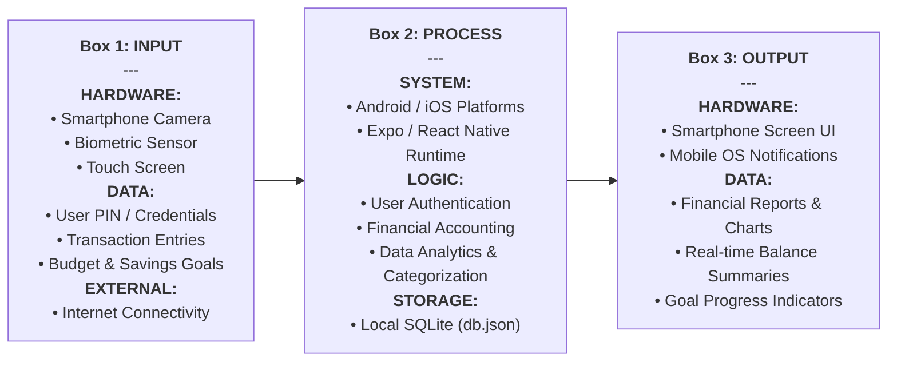

# Design of Software, Systems, Product, and/or Process

## Project Design
The system theme, the blue color, was chosen as it is a universal comfort color. The theme ensures a comfortable visual, making the application friendly for any eyesight condition. Meanwhile, the system interfaces were organized based on the Human-Computer Interaction standards, ensuring the white space, consistent resolution, and appropriate component shapes.

The design of the system is centered on creating a consistent and user‑friendly visual identity that enhances usability and overall user experience. It focuses on simplicity, clarity, and accessibility to ensure that users can easily navigate the application and understand its features regardless of their technical background.

The system is designed with a cross‑platform architecture using **React Native** and **Expo**, allowing it to function seamlessly on iOS, Android, and web platforms. It incorporates a structured layout, intuitive navigation, and responsive interface components to ensure smooth interaction across devices. Additionally, the design integrates essential features such as real‑time expense tracking, data visualization, and secure data handling, ensuring both functionality and reliability of the application.

---

### Figures

**Figure No 19. LogIn UI**

This figure showcases a login interface where users can enter their username and 4‑digit PIN to access their account.

**Figure No 20. Home UI**

This figure shows the homepage of the WiseWallet system, the main interface after log‑in.

**Figure No 21. Transactions UI**

This figure shows the transaction entry interface where users could enter their financial records.

**Figure No 22. Budget UI**

This figure shows the budget interface where users could set budgets and the remaining fixed cost.

**Figure No 23. Agenda & Reminders UI**

This figure shows the Agenda and Reminders for event goals and deadlines.

**Figure No 24. Savings Goals UI**

This figure shows the Savings interface where users could set a goal for a specific object, with the progress tracker showing the amount remaining to be fulfilled.

**Figure No 25. Reports UI**

This figure shows the Analytical Reports which are connected to the transaction records users had entered.

**Figure No 26. Financial Literacy UI**

This figure shows the Financial Literacy interface which shows financial tips, videos, and recommended reading for additional knowledge.

**Figure No 27. Settings UI**

This figure shows the Settings interface which functions as the system display’s personalization.

---

## Conceptual Framework

The WiseWallet utilizes an Input-Process-Output (IPO) model to illustrate the system's functional flow, detailing the relationship between hardware, software, and data management.

### IPO Diagram

### Functional Details

*   **Box 1: INPUT**: Gathers inputs from various sources. **Hardware** provides physical capture (camera, biometrics), while **Data** represents the logical information entered by the user. **External** factors like network connectivity facilitate initial setup.
*   **Box 2: PROCESS**: The core system layer. **System** components provide the environment, while **Logic** handles the actual accounting and security processing. **Storage** ensures data persistence on the local device.
*   **Box 3: OUTPUT**: The final presentation layer. **Hardware** outputs (Screen, Notifications) deliver information back to the user, while the **Data** represents the processed financial insights and visualizations.

---

## Testing Procedure
The WiseWallet undergoes a rigorous Unit Testing phase conducted through Alpha and Beta Testing stages, following an Agile development cycle. In Alpha Testing, the system is tested internally by the developers and selected individuals within a controlled environment. The researchers closely monitor the system by performing various tasks such as logging in, entering data, and navigating through different features. This process helps identify bugs, errors, and technical issues early, allowing developers to fix them before exposing the system to actual users.

Beta Testing is conducted by real users outside the development environment. These users interact with the system in real‑world conditions and provide feedback based on their experience. This stage focuses on evaluating the system’s usability, performance, and reliability from the user’s perspective. Any issues, suggestions, or improvements identified during beta testing are carefully reviewed and addressed.

To ensure maximum stability, the system follows a **2‑cycle testing rule**. The module must achieve a Run Pass. If errors occur, they are documented and fixed. Cycle 2: The module must be run again and achieve a mandatory Pass status. Failure to pass the second cycle requires the module to return to the debugging phase, ensuring that no feature is deployed until it successfully passes two consecutive validation runs.
